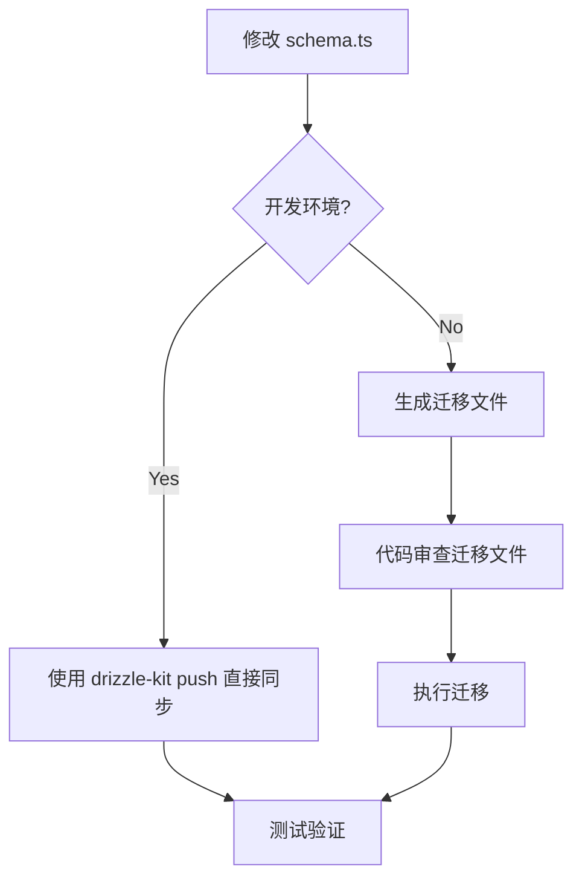

以下是关于 `drizzle-kit` 的详细说明，结合实际开发场景的完整示例，涵盖数据库初始化、表结构变更、迁移管理等核心功能：

---

### 一、`drizzle-kit` 的核心作用

#### 1. **核心功能**
- **自动生成迁移文件**：根据 `schema.ts` 的变更生成对应的 SQL 迁移脚本（如 `ALTER TABLE`、`CREATE INDEX` 等）
- **执行数据库迁移**：将生成的迁移文件应用到数据库，保证数据库结构与代码定义一致
- **数据库逆向工程**：从已有数据库生成 TypeScript Schema 定义
- **可视化操作**：通过 `drizzle-kit studio` 提供网页版数据库管理界面

#### 2. **关键特性**
- **无需预创建数据库**：首次迁移时会自动创建数据库（依赖数据库用户权限）
- **自动生成表结构**：根据 `schema.ts` 自动生成 `CREATE TABLE` 语句
- **增量变更管理**：仅生成必要的 SQL 变更语句，保留完整迁移历史

---

### 二、实际开发场景示例

#### 场景 1：初始化数据库

1. **定义初始 Schema (`src/schema.ts`)**：
   ```typescript
   // 用户表定义
   import { pgTable, serial, varchar } from 'drizzle-orm/pg-core';

   export const users = pgTable('users', {
     id: serial('id').primaryKey(),
     name: varchar('name', { length: 50 }).notNull(),
     email: varchar('email', { length: 255 }).unique().notNull()
   });
   ```

2. **生成迁移文件**：
   ```bash
   bunx drizzle-kit generate:pg
   ```
   ```sql
   -- 生成的迁移文件 drizzle/migrations/0000_initial_migration.sql
   CREATE TABLE IF NOT EXISTS users (
     id SERIAL PRIMARY KEY,
     name VARCHAR(50) NOT NULL,
     email VARCHAR(255) UNIQUE NOT NULL
   );
   ```

3. **应用迁移**：
   ```bash
   bunx drizzle-kit migrate:up
   ```
    - **实际效果**：自动创建 `users` 表，无需手动执行 SQL

---

#### 场景 2：修改表结构（添加字段）

1. **更新 Schema**：
   ```typescript
   // 添加 age 字段
   export const users = pgTable('users', {
     id: serial('id').primaryKey(),
     name: varchar('name', { length: 50 }).notNull(),
     email: varchar('email', { length: 255 }).unique().notNull(),
     age: integer('age')  // 新增字段
   });
   ```

2. **生成迁移文件**：
   ```bash
   bunx drizzle-kit generate:pg
   ```
   ```sql
   -- 生成迁移文件 drizzle/migrations/0001_add_age_column.sql
   ALTER TABLE users ADD COLUMN age INTEGER;
   ```

3. **应用变更**：
   ```bash
   bunx drizzle-kit migrate:up
   ```

---

#### 场景 3：复杂变更（修改字段类型）

1. **更新 Schema**：
   ```typescript
   // 修改 name 字段长度
   name: varchar('name', { length: 100 }).notNull() // 从 50 改为 100
   ```

2. **生成迁移文件**：
   ```bash
   bunx drizzle-kit generate:pg
   ```
   ```sql
   -- 生成的迁移文件
   ALTER TABLE users 
   ALTER COLUMN name TYPE VARCHAR(100);
   ```

3. **执行变更**：
   ```bash
   bunx drizzle-kit migrate:up
   ```

---

### 三、`drizzle-kit` 与数据库创建的关系

| 操作类型          | 是否需要手动创建                   | 示例命令                          |
|-------------------|------------------------------------|-----------------------------------|
| **数据库创建**    | 需要手动创建或确保用户有创建权限   | `CREATE DATABASE mydb;`           |
| **表结构创建**    | 自动通过迁移文件完成               | `bunx drizzle-kit migrate:up`     |
| **字段变更**      | 完全自动处理                       | 修改 `schema.ts` 后生成新迁移文件 |

---

### 四、`drizzle-kit push` 的典型用法

#### 1. **开发环境快速同步**
```bash
# 直接推送 Schema 变更到数据库（跳过生成迁移文件）
bunx drizzle-kit push:pg
```

#### 2. **输出示例**
```bash
Detected schema changes:
✔ Table `users` added column `age` (integer)
Apply these changes to the database? (y/N) y
Successfully applied changes!
```

#### 3. **与迁移文件的区别**
```typescript
// 传统迁移流程（生产环境推荐）
修改 schema => 生成迁移文件 => 审查 SQL => 执行迁移

// Push 模式（开发环境专用）
修改 schema => 直接推送变更
```

---

### 五、完整工作流程图



---

### 六、最佳实践建议

#### 1. **数据库初始化策略**
- **MySQL/PostgreSQL**：需手动创建空数据库，确保连接用户有 `CREATE` 权限
- **SQLite**：自动创建数据库文件（需文件系统写入权限）

#### 2. **团队协作规范**
- **迁移文件版本控制**：
  ```bash
  # .gitignore 排除项（应提交迁移文件）
  !drizzle/migrations/
  ```
- **禁止手动修改迁移文件**：已执行的迁移文件哈希值会记录在 `_meta.json` 中

#### 3. **生产环境部署**
```typescript
// 在服务启动脚本中自动执行迁移
import { migrate } from 'drizzle-orm/postgres-js/migrator';

async function bootstrap() {
  await migrate(db, {
    migrationsFolder: './drizzle/migrations'
  });
  // 启动应用服务...
}
```

---

### 七、常见问题解答

#### Q1: 可以完全不使用迁移文件吗？
- **可以但强烈不推荐**：`push` 模式适合开发环境，但生产环境必须使用迁移文件以保证变更可追溯

#### Q2: 如何修复错误的迁移？
```bash
# 1. 回滚迁移
bunx drizzle-kit migrate:down --steps 1

# 2. 修正 schema.ts

# 3. 生成新迁移文件
bunx drizzle-kit generate:pg

# 4. 重新应用
bunx drizzle-kit migrate:up
```

#### Q3: 如何从已有数据库生成 Schema？
```bash
# 逆向工程生成 Schema 文件
bunx drizzle-kit introspect:pg
```

---

通过以上示例和说明，可以看到 `drizzle-kit` 在数据库版本控制中的核心作用：**将代码定义的 Schema 变更安全、可控地同步到数据库**，同时提供开发环境下的快速迭代能力。